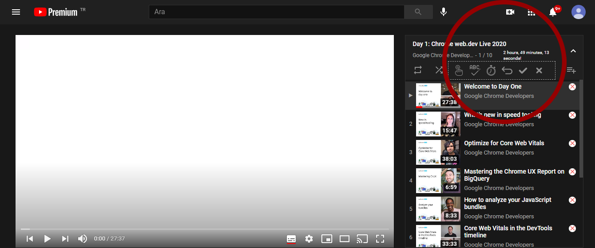

# YouTube Playlist Duration Calculator & Sorter
* You can see total playlist duration just above the videos.
* You can remove or add any videos you want from calculation.
* You can select any spesific video and see the length after that video to the last.
* You can also sort the playlist by name or length and then back to original playlist order.
* All private or deleted videos will be filtered after extension starts.

## Installation
* Chrome: [Web Store](https://chrome.google.com/webstore/detail/youtube-playlist-duration/dngkgieidmdojikecmaelophabnldbhh)
* Also can be installed manually as unpacked extension in developer mode to the browser.